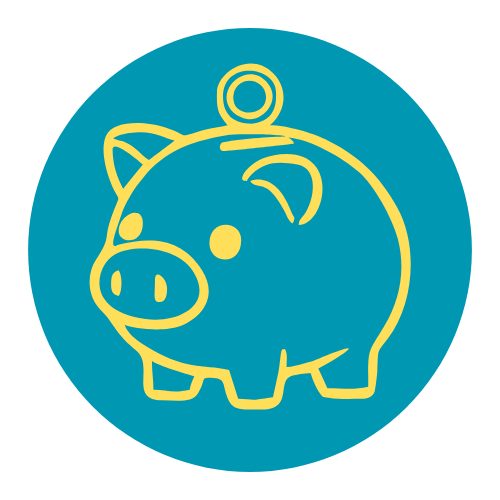

<div align="center">
  
  
  # 💰 Ledgerly
  
  **Smart Daily Budget Tracking**
  
  [](https://github.com/Kazu00/ledgerly-web)
  [](LICENSE)
  [](https://www.djangoproject.com/)
  [](https://tailwindcss.com/)
  
  *Take control of your daily spending with intelligent budget management*
  
  [Features](#-features) • [Installation](#-installation) • [Usage](#-usage) • [Screenshots](#-screenshots) • [Contributing](#-contributing)
</div>

---

## 🌟 Overview

**Ledgerly** is a modern, intelligent daily budget tracker designed to help you manage your expenses with precision and ease. Built with Django and enhanced with a beautiful Tailwind CSS interface, Ledgerly offers a seamless experience for tracking your daily spending, managing savings, and visualizing your financial habits.

Unlike traditional budget apps that focus on monthly totals, Ledgerly emphasizes **daily budget discipline**—helping you build sustainable spending habits one day at a time.

---

## ✨ Features

### 💳 **Smart Daily Budget System**
- **Automatic Budget Carryover**: Unspent budget automatically rolls over to the next day
- **Manual Budget Adjustments**: Reset or modify your budget anytime with manual override
- **Real-time Status Indicators**: 
  - 🔵 **Underspent** (< 50% of budget used)
  - 🟢 **Balanced** (50-99% of budget used)
  - 🔴 **Overspent** (≥ 100% of budget used)

### 🏦 **Savings Account Integration**
- Track total savings separately from daily budgets
- Withdraw from savings to boost your daily budget when needed
- Add to savings from any remaining budget

### 📊 **Expense Categorization**
- Create custom expense categories with color coding
- Prebuilt categories (Savings, Emergency Funds, Food Fund)
- Visual category breakdown in daily and monthly views
- Percentage-based analytics per category

### 📅 **Calendar & Summary Views**
- Interactive monthly calendar with daily spending overview
- Hover tooltips showing budget status for each day
- Monthly summary with category percentages
- Navigate seamlessly between dates

### 🎨 **Beautiful Dark UI**
- Modern, gradient-rich interface
- Discord-inspired patch notes modal
- Smooth animations and transitions
- Fully responsive design for all devices

### 🔒 **Security & Privacy**
- User authentication system
- Personal data isolation per user
- Session-based security

---

## 🚀 Installation

### Prerequisites

- Python 3.10 or higher
- Node.js 16 or higher (for Tailwind CSS)
- pip (Python package manager)

### Quick Start

1. **Clone the repository**
   ```bash
   git clone https://github.com/Kazu00/ledgerly-web.git
   cd ledgerly-web
   ```

2. **Create and activate virtual environment**
   ```bash
   python -m venv venv
   
   # Windows
   venv\Scripts\activate
   
   # macOS/Linux
   source venv/bin/activate
   ```

3. **Install Python dependencies**
   ```bash
   pip install -r requirements.txt
   ```

4. **Install Tailwind CSS dependencies**
   ```bash
   cd theme/static_src
   npm install
   cd ../..
   ```

5. **Run database migrations**
   ```bash
   python manage.py migrate
   ```

6. **Create a superuser (optional)**
   ```bash
   python manage.py createsuperuser
   ```

7. **Build Tailwind CSS**
   ```bash
   python manage.py tailwind build
   ```

8. **Run the development server**
   ```bash
   python manage.py runserver
   ```

9. **Access the application**
   
   Open your browser and navigate to `http://localhost:8000`

---

## 📖 Usage

### Getting Started

1. **Register an Account**: Create your personal account on the registration page
2. **Set Your Budget**: Navigate to today's date and set your initial daily budget
3. **Track Expenses**: Add expenses with descriptions, amounts, and optional categories
4. **Monitor Status**: Watch your budget status change from Underspent → Balanced → Overspent
5. **Review Insights**: Check the calendar and monthly summary for spending patterns

### Key Workflows

#### Adding an Expense
```
1. Enter expense description (e.g., "Coffee at Starbucks")
2. Select or create a category (optional)
3. Input the amount
4. Click "Add Expense"
```

#### Managing Savings
```
1. Add to savings from your remaining daily budget
2. Withdraw from savings to boost today's budget when needed
3. Track total savings in the dedicated card
```

#### Resetting Budget
```
1. Click "Reset Budget" on any day
2. Sets remaining budget to zero for that day
3. Future days automatically adjust to reflect the reset
```

---

## 🖼️ Screenshots

<div align="center">
  <em>Daily Budget View • Calendar Overview • Monthly Summary</em>
</div>

---

## 🛠️ Tech Stack

- **Backend**: Django 5.2.6
- **Frontend**: Django Templates + Tailwind CSS 4.2.0
- **Database**: SQLite (development) / PostgreSQL (production-ready)
- **Styling**: Custom Tailwind configuration with gradient themes
- **Icons**: Font Awesome 6.5.1
- **Server**: Gunicorn (production)

---

## 📋 Changelog

### Version 1.0.3 (Current)
**Bug Fixes:**
- ✅ Corrected budget status thresholds for accurate spending categorization
  - Underspent: < 50% of daily budget
  - Balanced: ≥ 50% and < 100% of daily budget
  - Overspent: ≥ 100% of daily budget
- ✅ Fixed carryover logic for manual budget adjustments

### Version 1.0.2
**Improvements:**
- ✨ Added monthly summary with category percentages
- ✨ Reset Budget now persists when navigating between dates
- ✨ Prebuilt categories for faster expense entry

**New Features:**
- 🎯 Category breakdown visualization in daily view
- 📊 Monthly summary page with detailed expense analytics

### Version 1.0.1
**Initial Features:**
- 🎉 Daily budget tracking with automatic carryover
- 💾 Savings account management
- 📅 Interactive calendar view
- 🎨 Dark mode UI with modern gradients

---

## 🤝 Contributing

We welcome contributions from the community! Here's how you can help:

1. **Fork the repository**
2. **Create a feature branch**
   ```bash
   git checkout -b feature/AmazingFeature
   ```
3. **Commit your changes**
   ```bash
   git commit -m 'Add some AmazingFeature'
   ```
4. **Push to the branch**
   ```bash
   git push origin feature/AmazingFeature
   ```
5. **Open a Pull Request**

### Coding Standards
- Follow PEP 8 for Python code
- Use meaningful variable and function names
- Add comments for complex logic
- Test your changes thoroughly
- Update documentation as needed

---

## 🔐 Security

Ledgerly implements several security measures:

- ✅ User authentication and authorization
- ✅ CSRF protection on all forms
- ✅ Session-based security
- ✅ SQL injection protection via Django ORM
- ✅ XSS prevention through template escaping

**Note**: This project is designed for personal/educational use. For production deployment, additional security hardening is recommended (HTTPS, environment variables for secrets, etc.).

---

## 📄 License

This project is licensed under the **MIT License** - see the [LICENSE](LICENSE) file for details.

```
MIT License - Copyright (c) 2025 Kazu00
```

---

## 🙏 Acknowledgments

- **Django Community** for the robust web framework
- **Tailwind CSS** for the utility-first styling system
- **Font Awesome** for the beautiful iconography
- **Open Source Contributors** who inspire and educate

---

## 📞 Support

If you encounter any issues or have questions:

- 🐛 [Open an Issue](https://github.com/Kazu00/ledgerly-web/issues)
- 💡 [Start a Discussion](https://github.com/Kazu00/ledgerly-web/discussions)
- 📧 Contact: [Your Email]

---

<div align="center">
  
  **Made with ❤️ and ☕ by Kazu00**
  
  ⭐ Star this repo if you find it helpful!
  
  [⬆ Back to Top](#-ledgerly)
  
</div>
